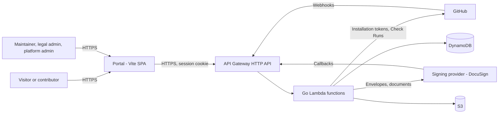
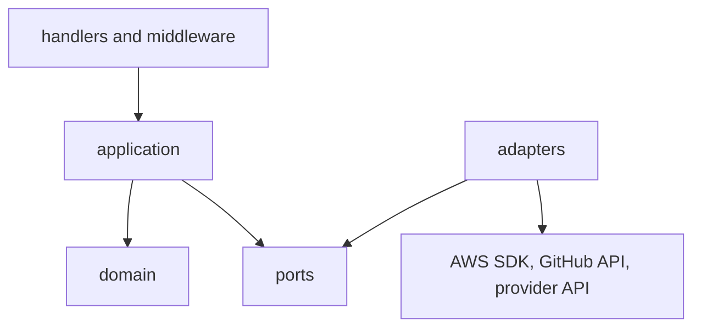
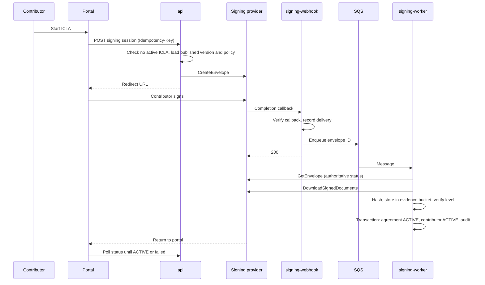

# Architecture Specification

| Field | Value |
| --- | --- |
| Status | Draft — in review |
| Related | [Requirements](requirements.md), [domain model](domain-model.md), [security](security/security.md), [API conventions](api/conventions.md), [ADRs](../docs/decisions/README.md) |

## 1. System context



Trust boundaries: the public internet, GitHub, the signing provider, and the AWS account. Every
inbound request from outside the account is authenticated or verified before processing. See the
[threat model](security/threat-model.md).

## 2. Components

| Component | Technology | Responsibility |
| --- | --- | --- |
| Portal | Vite, React, TypeScript, React Router, TanStack Query | Public catalogue, signing flows, dashboards, administration. |
| Static hosting | S3 (private) + CloudFront with Origin Access Control | Serves the built portal ([ADR-0010](../docs/decisions/0010-cloudfront-frontend-hosting.md)). |
| API | API Gateway HTTP API | Routes, throttling, CORS, access logs. |
| Backend | Go on AWS Lambda (`provided.al2023`, arm64) | Use cases behind a hexagonal architecture ([ADR-0008](../docs/decisions/0008-hexagonal-go-backend-on-lambda.md)). |
| Queues | Amazon SQS with dead-letter queues | Decouple webhooks from processing ([ADR-0008](../docs/decisions/0008-hexagonal-go-backend-on-lambda.md)). |
| Scheduler | Amazon EventBridge Scheduler | Revalidation, session expiry, reconciliation. |
| Metadata | DynamoDB `core`, `audit`, `ephemeral` | See [domain model](domain-model.md#5-persistence-dynamodb). |
| Documents | S3 `documents`, `evidence`, `artifacts` | See [domain model](domain-model.md#6-persistence-s3). |
| Keys | AWS KMS | Encryption at rest; HMAC key for email lookup values (D-19). |
| Secrets | AWS Secrets Manager | GitHub App private key and webhook secret, OAuth client secret, provider credentials. |
| Observability | CloudWatch Logs, metrics, alarms, dashboards; AWS X-Ray (optional) | |
| Audit of AWS actions | AWS CloudTrail | Management events; S3 data events on the `evidence` bucket. |
| Edge protection | AWS WAF (optional, D-16) | Rate-based rules and managed rule groups. |

## 3. Backend structure

### 3.1 Layers



| Layer | Path | Rules |
| --- | --- | --- |
| Domain | `services/api/internal/domain` | Entities, value objects, state machines, invariants. No I/O, no SDK imports. |
| Application | `services/api/internal/application` | Use cases. Orchestrates domain and ports. Owns transactions and audit events. |
| Ports | `services/api/internal/ports` | Go interfaces for repositories, document storage, signing, GitHub, queues, secrets, clock, IDs, MAC. |
| Adapters | `services/api/internal/adapters/{aws,github,signing}` | Port implementations. The only place SDKs are imported. |
| Handlers | `services/api/internal/handlers` | Translate HTTP and queue events into use-case calls. Map errors to the API error format. |
| Middleware | `services/api/internal/middleware` | Correlation IDs, authentication, authorization, logging, recovery, body limits. |
| Entry points | `services/api/cmd/{function}` | One `main` per Lambda function; wiring only. |

Import rules are enforced in CI (for example with `depguard` in `golangci-lint`): `domain` imports
nothing from other layers, and no layer except `adapters` imports SDK packages.

### 3.2 Principal ports

| Port | Purpose |
| --- | --- |
| `SigningProvider` | `CreateEnvelope`, `GetEnvelope`, `DownloadSignedDocuments`, `ValidateWebhook`, plus `Capabilities` (delivered signature levels). |
| `GitHubApp` | Installation tokens, pull-request commits, Check Runs, team membership. |
| `GitHubIdentity` | OAuth authorization-code exchange and user identity. |
| Repositories | One per aggregate: agreements, contributors, organizations, documents, policies, evaluations. |
| `UnitOfWork` | Atomic multi-item writes (DynamoDB transactions), including audit events. |
| `DocumentStore` | Put, get, and head objects with checksum verification. |
| `Queue` | Enqueue processing messages. |
| `Mac` | Keyed hashing (KMS HMAC) for emails and tokens. |
| `Clock`, `IDGenerator` | Deterministic tests. |

### 3.3 Lambda functions

As proposed in [ADR-0008](../docs/decisions/0008-hexagonal-go-backend-on-lambda.md): `api`,
`github-webhook`, `signing-webhook`, `signing-worker`, `github-worker`, `scheduler`. Each has its own
IAM role, log group, alarms, and reserved concurrency limit.

## 4. API surface

API Gateway routes are grouped by audience. OpenAPI is the source of truth
([`api/openapi.yaml`](api/openapi.yaml)); conventions are in [`api/conventions.md`](api/conventions.md).

| Group | Prefix | Function | Authentication |
| --- | --- | --- | --- |
| Health | `/v1/health` | `api` | None |
| Public catalogue | `/v1/public/...` | `api` | None |
| Authentication | `/v1/auth/...` | `api` | OAuth flow |
| Current user and contributor | `/v1/me/...` | `api` | Session |
| Agreements and signing sessions | `/v1/agreements/...`, `/v1/signing-sessions/...` | `api` | Session |
| Organizations | `/v1/organizations/...` | `api` | Session and role |
| Maintainer and administration | `/v1/admin/...` | `api` | Session and role |
| GitHub webhook | `/v1/webhooks/github` | `github-webhook` | HMAC signature |
| Signing-provider webhook | `/v1/webhooks/signing/{provider}` | `signing-webhook` | Provider verification |

## 5. Key flows

### 5.1 ICLA signing



The portal never treats the provider redirect as proof of signing. Only the worker activates
agreements.

### 5.2 Pull-request validation

```mermaid
sequenceDiagram
  participant G as GitHub
  participant W as github-webhook
  participant Q as SQS
  participant K as github-worker
  G->>W: pull_request event
  W->>W: Verify signature, dedupe delivery ID
  W->>Q: Enqueue repository, PR, head SHA
  W-->>G: 202
  Q->>K: Message
  K->>K: Load project policy; skip if not enforced
  K->>G: Create Check Run in progress
  K->>G: List PR commits (installation token)
  K->>K: Resolve contributors and evaluate coverage
  K->>G: Complete Check Run with outcome and signing link
```

The full validation algorithm is specified in the Phase 8 feature specification (FR-GH-10).

## 6. Reliability and idempotency

- Webhooks are acknowledged after verification and enqueueing. Processing happens in workers.
- Delivery records in the `ephemeral` table prevent duplicate processing; conditional writes on
  entity state make processing safe even when a duplicate passes the delivery check.
- SQS retries with exponential backoff; messages that exceed the retry limit go to a dead-letter
  queue with an alarm.
- Provider outage: new signing sessions fail with a clear, retryable error; callbacks are retried by
  the provider; the reconciliation job polls envelopes stuck in `PENDING_SIGNATURE` or `VERIFYING`.
- GitHub outage: Check Run updates are retried from the queue. Evaluations stay `ACTION_REQUIRED`
  until they succeed.

## 7. Frontend architecture

| Concern | Approach |
| --- | --- |
| Layout | `apps/web` (application), `packages/design-system` (tokens and components), `packages/api-client` (typed client generated from OpenAPI), `packages/shared-types`. |
| Routing | React Router with route-level code splitting and role-aware route guards. Guards improve UX only; the API enforces authorization. |
| Data | TanStack Query for server state; no global client store unless justified. |
| Authentication | HttpOnly session cookie set by the API; the SPA never sees tokens. |
| Design system | Tokens and components from [design tokens](ux/design-tokens.md); pages compose components only. |
| Preview | Storybook for components, with accessibility and visual regression checks. |
| Testing | Vitest and Testing Library for units and components; Playwright for end-to-end flows. |

## 8. Environments

| Environment | Purpose | Deployment |
| --- | --- | --- |
| `dev` | Integration of merged changes. | Automatic on merge to `main`. |
| `staging` | Pre-production verification with provider sandbox. | Automatic after `dev` succeeds, or on release tag. |
| `production` | Live service. | Release tag plus GitHub environment approval. |

Each environment has its own AWS account (D-04). The default region is `eu-west-1`, unless the
platform owner or a data-residency policy requires `eu-south-2`. Account IDs and other
environment-specific identifiers are supplied through GitHub environment variables, never
committed.

## 9. Infrastructure as code

```text
infra/
  modules/        reusable modules: api-gateway, lambda-function, iam, dynamodb-table,
                  s3-bucket, kms-key, log-group, secret, sqs-queue, scheduler,
                  github-oidc-role, waf, custom-domain, static-site
  environments/
    dev/          root module: composes modules with environment variables
    staging/
    production/
  bootstrap/      one-time state backend and deployment role (D-05)
```

Environment root modules contain composition and variables only; logic lives in modules.

Remote state (D-05) uses the Terraform S3 backend with S3-native locking (`use_lockfile = true`)
and no DynamoDB lock table. Each account has its own versioned, encrypted state bucket with S3
Block Public Access, created once by the platform owner with `infra/bootstrap`. Backend settings
are supplied at `terraform init` time through partial configuration, not committed.

## 10. CI/CD

| Workflow | Trigger | Purpose |
| --- | --- | --- |
| `ci.yml` (existing) | PR, push to `main` | Repository governance checks. |
| Backend | PR, push | `go vet`, `golangci-lint`, unit and integration tests, `govulncheck`. |
| Frontend | PR, push | Type check, lint, unit and component tests, accessibility checks, build. |
| OpenAPI | PR, push | Lint the contract; check generated client is up to date. |
| Terraform | PR, push | `fmt`, `validate`, TFLint, security scan, plan in protected environments. |
| Security | PR, schedule | CodeQL (SAST), dependency review, secret scanning, Scorecard. |
| Deploy | Merge, tag | Build, package, apply per environment with OIDC; production requires approval. |

Deployments assume AWS roles through GitHub OIDC; no long-lived AWS keys are stored in GitHub.

## 11. Observability

- JSON structured logs (`log/slog`) with `request_id`, `function`, `operation`, and outcome. No
  personal data, tokens, or document contents.
- Custom metrics: signing sessions created, completed, failed; callbacks rejected; webhooks
  rejected; Check Runs by outcome; worker retries; DLQ depth.
- Alarms: Lambda errors, API 5xx, failed callbacks, failed Check Runs, DynamoDB throttling, S3
  errors, unauthorized-access spikes, signing workflow timeouts, DLQ messages.

## 12. Monorepo layout

```text
.github/            workflows, CODEOWNERS, dependabot
docs/               guides, operations, decisions/
specs/              requirements, architecture, domain model, api/, security/, ux/,
                    features/, test-scenarios/
apps/web/           portal
services/api/       Go module: cmd/, internal/, tests/
packages/           api-client, design-system, shared-types
infra/              modules/, environments/, bootstrap/
scripts/            developer scripts
```

## 13. Open decisions affecting the architecture

D-02, D-06, D-16. See the [decision log](../docs/decisions/decision-log.md).
