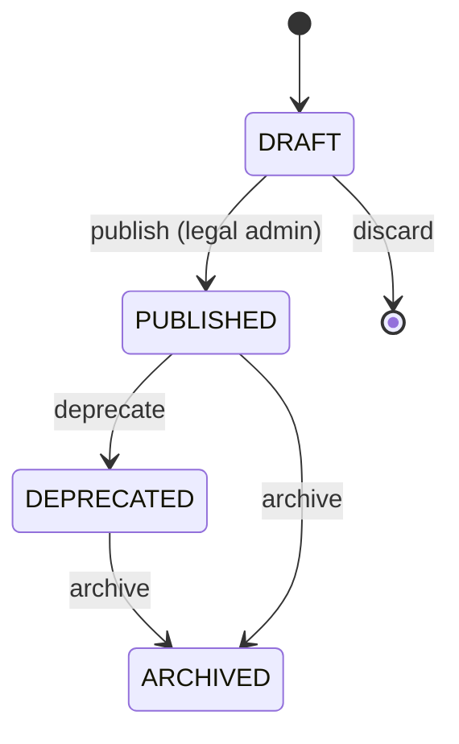
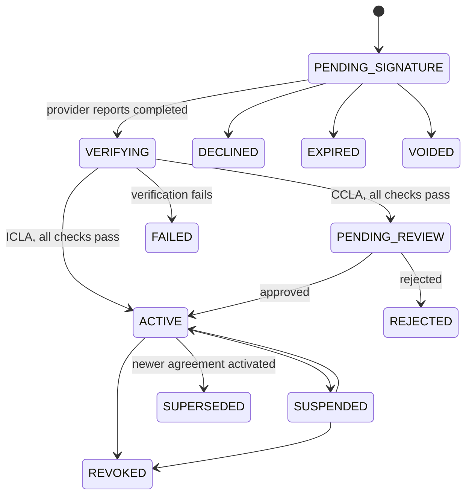
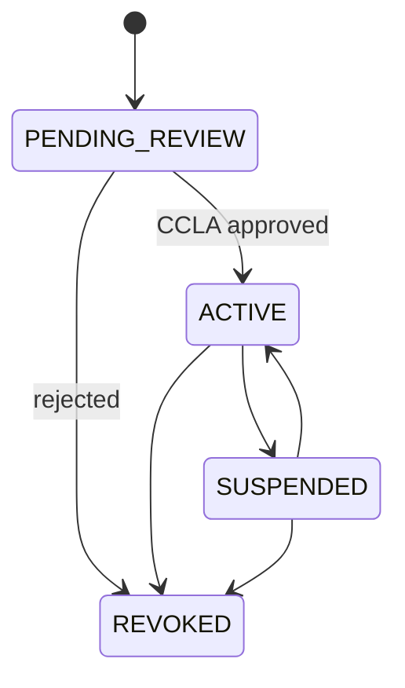

# Domain Model

| Field | Value |
| --- | --- |
| Status | Draft — in review |
| Related | [Requirements](requirements.md), [architecture](architecture.md), [ADR-0009](../docs/decisions/0009-dynamodb-table-layout.md) |

This document defines entities, invariants, state machines, and their persistence. Changes require
the change-control process in [the SDD workflow](sdd-workflow.md#3-change-control).

## 1. Identifiers and conventions

- Internal identifiers are ULIDs (sortable, 26 characters), except where stated.
- The contributor identifier is the immutable **GitHub user ID** (numeric, stored as a string).
  GitHub logins can change and are never used as keys.
- Repositories are identified by the immutable **GitHub repository ID**. The `owner/name` form is
  stored for display.
- Timestamps are UTC, RFC 3339, millisecond precision.
- Hashes are lowercase hexadecimal SHA-256.
- Every mutable item has an integer `version` attribute for optimistic concurrency.

## 2. Entities

### 2.1 CLA document and version

A **CLA document** is a stable public identity for an agreement text (for example the ICLA). A
**CLA document version** is one immutable published text in one language.

| Attribute | Type | Notes |
| --- | --- | --- |
| `document_id` | string | Stable slug chosen by Legal, for example per agreement type. |
| `type` | enum | `ICLA`, `CCLA`. |
| `version` | string | Version label, for example `1.0`. Unique per document. |
| `language` | string | BCP 47 tag. Supported languages: D-21. |
| `status` | enum | `DRAFT`, `PUBLISHED`, `DEPRECATED`, `ARCHIVED`. |
| `effective_date` | date | When the version takes effect. |
| `sha256` | string | Hash of the published document bytes. Set at publication. |
| `content_key` | string | S3 key of the published document. |
| `source_path` | string | Path of the canonical text in the public repository. |
| `published_at`, `published_by` | timestamp, actor | Set at publication. |

### 2.2 Contributor

| Attribute | Type | Notes |
| --- | --- | --- |
| `github_user_id` | string | Primary identifier. |
| `github_login` | string | Display only; refreshed on sign-in and webhook events. |
| `status` | enum | `PENDING`, `ACTIVE`, `SUSPENDED`, `REVOKED`. |
| `active_icla_agreement_id` | string | Optional. |
| `verified_at` | timestamp | When coverage was first verified. |
| `last_revalidated_at` | timestamp | Last revalidation. |
| `status_reason` | string | Required for `SUSPENDED` and `REVOKED`. No personal data. |

`PENDING` and `ACTIVE` are maintained by the application from agreement state. `SUSPENDED` and
`REVOKED` are administrative overrides that remove coverage regardless of agreements.

A contributor has zero or more **email lookup values**, one per verified GitHub email, stored as
separate items. Each value is `{key_version}:{hex_mac}`, computed as described in
[data protection](security/data-protection.md#4-email-lookup-values-d-19). Raw email addresses are
never persisted.

### 2.3 Agreement

A signed (or in-progress) ICLA or CCLA instance.

| Attribute | Type | Notes |
| --- | --- | --- |
| `agreement_id` | ULID | |
| `type` | enum | `ICLA`, `CCLA`. |
| `document_id`, `document_version`, `document_language` | string | The exact version presented for signing. |
| `document_sha256` | string | Hash of the version presented. Must equal the published hash. |
| `status` | enum | See section 3.2. |
| `github_user_id` | string | ICLA signer. Empty for CCLA. |
| `organization_id` | ULID | CCLA only. |
| `signing_policy_id`, `signing_policy_version` | string, integer | Policy in force when signing started. |
| `signature_level_required` | enum | From the signing policy. |
| `signature_level_delivered` | enum | From the provider adapter's declared capability. |
| `signing_provider` | string | Adapter identifier, for example `docusign`. |
| `signing_envelope_id` | string | Provider envelope ID. |
| `signed_document_key`, `signed_document_sha256` | string | Private S3 object and hash. |
| `evidence_document_key`, `evidence_sha256` | string | Private S3 object and hash. |
| `effective_date`, `signed_at`, `activated_at` | timestamp | |
| `ended_at`, `end_reason` | timestamp, string | For revoked, superseded, or expired agreements. |

Signature levels: `ELECTRONIC`, `ADVANCED`, `QUALIFIED`. Ordering is `ELECTRONIC` < `ADVANCED` <
`QUALIFIED`. The UI shows `QUALIFIED` only when it is the delivered level
([ADR-0004](../docs/decisions/0004-provider-neutral-signing-and-signature-level.md)).

### 2.4 Signer

One per required signer of an agreement (CCLAs may have several).

| Attribute | Type | Notes |
| --- | --- | --- |
| `agreement_id` | ULID | |
| `signer_index` | integer | Order within the envelope. |
| `role` | enum | `CONTRIBUTOR`, `REPRESENTATIVE`, `COUNTERSIGNER`. |
| `github_user_id` | string | Optional; required for `CONTRIBUTOR`. |
| `name_encrypted` | string | Encrypted with a KMS data key. Needed by the provider. |
| `email_mac` | string | Keyed HMAC lookup value. The raw email is passed to the provider at envelope creation and never persisted. |
| `stated_authority` | string | Representative's stated title and authority (CCLA). |
| `status` | enum | `PENDING`, `SIGNED`, `DECLINED`. |
| `signed_at` | timestamp | |

### 2.5 Signing session

Tracks one attempt to sign through the provider.

| Attribute | Type | Notes |
| --- | --- | --- |
| `session_id` | ULID | |
| `agreement_id` | ULID | |
| `initiated_by` | string | GitHub user ID. |
| `provider`, `envelope_id` | string | |
| `status` | enum | `CREATED`, `REDIRECTED`, `RETURNED`, `COMPLETED`, `ABANDONED`, `EXPIRED`, `FAILED`. |
| `return_nonce_hash` | string | Hash of the one-time nonce bound to the return URL. |
| `expires_at` | timestamp | Session expiry; enforced by the scheduler. |

### 2.6 Organization

| Attribute | Type | Notes |
| --- | --- | --- |
| `organization_id` | ULID | |
| `legal_name` | string | |
| `jurisdiction` | string | ISO 3166 country code, optionally with subdivision. |
| `status` | enum | `PENDING_REVIEW`, `ACTIVE`, `SUSPENDED`, `REVOKED`. |
| `active_ccla_agreement_id` | ULID | |
| `covered_scope` | enum and list | `ALL_ENFORCED` or a list of repository IDs. |
| `revalidation_interval_days` | integer | Configuration; default set in the Phase 7 specification. |

### 2.7 Authorized contributor

A contributor covered by an organization's CCLA. Stored as separate items, not a list attribute,
so lists are unbounded and individually audited.

| Attribute | Type | Notes |
| --- | --- | --- |
| `organization_id` | ULID | |
| `github_user_id` | string | |
| `status` | enum | `ACTIVE`, `REMOVED`, `REVALIDATION_REQUIRED`. |
| `added_by`, `added_at` | actor, timestamp | Representative or authorized role. |
| `last_revalidated_at` | timestamp | |
| `scope` | list | Optional narrower repository list. |

### 2.8 Project policy

| Attribute | Type | Notes |
| --- | --- | --- |
| `repository_id` | string | GitHub repository ID. |
| `repository_full_name` | string | Display only. |
| `installation_id` | string | GitHub App installation. |
| `cla_required` | boolean | `false` means never blocked. |
| `accepted_agreement_types` | set | Subset of `ICLA`, `CCLA`. |
| `covered_organizations` | set | Optional allowlist of organization IDs; empty means any active CCLA. |
| `status` | enum | `ACTIVE`, `DISABLED`. |

### 2.9 GitHub installation

| Attribute | Type | Notes |
| --- | --- | --- |
| `installation_id` | string | |
| `account_id`, `account_login` | string | GitHub organization or user. |
| `status` | enum | `ACTIVE`, `SUSPENDED`, `DELETED`. |
| `repository_selection` | enum | `ALL`, `SELECTED`. |

### 2.10 Check evaluation

The result of evaluating one pull-request head commit. Used for idempotency, revalidation, and
support.

| Attribute | Type | Notes |
| --- | --- | --- |
| `repository_id`, `pull_number`, `head_sha` | string, integer, string | Composite identity. |
| `outcome` | enum | `PASSED`, `ACTION_REQUIRED`, `FAILED`, `SKIPPED`. |
| `contributors` | list | Per contributor: GitHub user ID or unresolved identity hash, coverage source, result. |
| `check_run_id` | string | GitHub Check Run ID. |
| `policy_version` | integer | Policy version used. |
| `evaluated_at` | timestamp | |

### 2.11 Signing policy

| Attribute | Type | Notes |
| --- | --- | --- |
| `policy_id` | string | One per agreement type. |
| `version` | integer | Immutable once used. |
| `required_signature_level` | enum | Legal decision (D-09). |
| `required_evidence` | set | For example `SIGNED_DOCUMENT`, `COMPLETION_CERTIFICATE`. |
| `signer_roles` | list | Required signer roles and order. |
| `session_ttl_minutes` | integer | |

### 2.12 Audit event

| Attribute | Type | Notes |
| --- | --- | --- |
| `event_id` | ULID | |
| `event_type` | string | Dotted name, for example `agreement.activated`. |
| `actor_type` | enum | `CONTRIBUTOR`, `MAINTAINER`, `LEGAL_ADMIN`, `PLATFORM_ADMIN`, `SYSTEM`, `GITHUB`, `SIGNING_PROVIDER`. |
| `actor_id` | string | GitHub user ID or system component name. |
| `entity_type`, `entity_id` | string | |
| `timestamp` | timestamp | |
| `request_id` | string | Correlation ID. |
| `metadata` | map | Non-sensitive context. Never contains personal data or secrets. |
| `document_hash` | string | When a document is involved. |
| `previous_value_hash`, `new_value_hash` | string | Hash of the canonical JSON of the entity before and after. |
| `chain_hash` | string | Hash of this event and the previous event's `chain_hash` for the same entity. |

## 3. State machines

### 3.1 CLA document version



Content and hash are fixed at `PUBLISHED`. A deprecated version cannot be used for new signing
sessions. Whether existing agreements must be re-signed when a new version is published is open
(D-22). The recorded recommendation, subject to Legal approval: substantive legal or scope changes
require re-signing; purely editorial changes do not. Each published version would then carry a
change classification (`SUBSTANTIVE` or `EDITORIAL`) set by Legal.

### 3.2 Agreement



`VERIFYING` covers: status re-read from the provider, document and evidence download, storage,
hashing, and the signature-level check. `FAILED` is retryable by a new signing session.

### 3.3 Organization



## 4. Invariants

| ID | Invariant |
| --- | --- |
| INV-01 | A contributor has at most one `ACTIVE` ICLA. |
| INV-02 | An agreement is `ACTIVE` only if its signed document and required evidence are stored, their hashes are recorded, `document_sha256` matches the published version, and `signature_level_delivered` ≥ `signature_level_required`. |
| INV-03 | A published document version never changes content or hash. |
| INV-04 | CCLA coverage requires: organization `ACTIVE`, CCLA `ACTIVE`, authorized-contributor entry `ACTIVE`, and the repository within scope. |
| INV-05 | Coverage is never derived from an email domain. |
| INV-06 | A `SUSPENDED` or `REVOKED` contributor is never covered. |
| INV-07 | Audit events are never updated or deleted by the application. |
| INV-08 | Every state transition writes its audit event in the same transaction. |
| INV-09 | Only transitions in section 3 are allowed; each write is conditional on the expected current state and `version`. |
| INV-10 | When coverage cannot be determined, the evaluation outcome is `ACTION_REQUIRED`, never `PASSED`. |

## 5. Persistence: DynamoDB

Three tables per environment, as proposed in
[ADR-0009](../docs/decisions/0009-dynamodb-table-layout.md). All use on-demand capacity,
customer-managed KMS keys, point-in-time recovery, and deletion protection.

### 5.1 `core` table

Keys: `PK` (partition), `SK` (sort). Overloaded global secondary indexes `GSI1`–`GSI3`.

| Entity | `PK` | `SK` |
| --- | --- | --- |
| CLA document version | `DOC#{document_id}` | `VER#{version}#LANG#{language}` |
| Contributor | `CONTRIB#{github_user_id}` | `PROFILE` |
| Contributor email lookup value | `CONTRIB#{github_user_id}` | `EMAILMAC#{key_version}:{hex_mac}` |
| Contributor agreement link | `CONTRIB#{github_user_id}` | `AGR#{agreement_id}` |
| Agreement | `AGR#{agreement_id}` | `META` |
| Signer | `AGR#{agreement_id}` | `SIGNER#{signer_index}` |
| Signing session | `AGR#{agreement_id}` | `SESSION#{session_id}` |
| Organization | `ORG#{organization_id}` | `META` |
| Authorized contributor | `ORG#{organization_id}` | `MEMBER#{github_user_id}` |
| Project policy | `REPO#{repository_id}` | `POLICY` |
| Check evaluation | `REPO#{repository_id}` | `PR#{pull_number}#SHA#{head_sha}` |
| GitHub installation | `INST#{installation_id}` | `META` |
| Signing policy | `SIGNPOL#{policy_id}` | `V#{version}` |

| Index | Key | Access pattern |
| --- | --- | --- |
| `GSI1` | `GSI1PK = ENV#{provider}#{envelope_id}` | Find agreement and session from a provider callback. |
| `GSI1` | `GSI1PK = EMAILMAC#{key_version}:{hex_mac}` | Resolve a commit email to a contributor. |
| `GSI2` | `GSI2PK = STATUS#{entity}#{status}`, `GSI2SK = {updated_at}` | Pending-review queue; published documents; sessions to expire. |
| `GSI3` | `GSI3PK = GHUSER#{github_user_id}`, `GSI3SK = ORG#{organization_id}` | Organizations covering a contributor (validation). |
| `GSI3` | `GSI3PK = LOGIN#{lowercase_login}` | Search contributors by login. |

### 5.2 `audit` table

| Key | Value |
| --- | --- |
| `PK` | `ENTITY#{entity_type}#{entity_id}` |
| `SK` | `{timestamp}#{event_id}` |
| `GSI1` | `ACTOR#{actor_type}#{actor_id}`, sorted by timestamp |
| `GSI2` | `DAY#{yyyy-mm-dd}`, sorted by timestamp, for chronological browsing and export |

DynamoDB Streams on this table feed the audit export to S3 evidence storage.

### 5.3 `ephemeral` table

Short-lived records with TTL on the `expires_at` attribute.

| Record | `PK` | Lifetime |
| --- | --- | --- |
| GitHub delivery | `DELIVERY#github#{delivery_id}` | Proposed 7 days |
| Provider callback | `DELIVERY#{provider}#{event_hash}` | Proposed 7 days |
| Idempotency key | `IDEMP#{caller}#{key}` | 24 hours |
| OAuth state | `OAUTH#{state_hash}` | 10 minutes |
| Portal session | `SESSION#{session_token_hash}` | Session lifetime (D-06) |

TTL deletion is not immediate. Readers must check `expires_at` and treat expired items as absent.

### 5.4 Consistency

- State transitions read the base table with strongly consistent reads, then write conditionally on
  `status` and `version`.
- GSIs are eventually consistent. A GSI result used for authorization or coverage is confirmed by a
  strongly consistent `GetItem` on the base item.
- Coverage evaluation reads current state at evaluation time. A later change triggers revalidation
  rather than relying on stale results.

### 5.5 Transactional boundaries

`TransactWriteItems` (maximum 100 items, same account and region) is used for:

| Operation | Items |
| --- | --- |
| Activate ICLA | Agreement status (conditional), contributor link and status, supersede previous ICLA, audit events. |
| Approve CCLA | Agreement status, organization status, audit events. |
| Publish document version | Version status (conditional on `DRAFT`), audit event. |
| Add or remove authorized contributor | Member item, audit event. |
| Change policy | Policy item (conditional on `version`), audit event. |

S3 writes cannot join DynamoDB transactions. Documents are written to S3 **first**, then the
transaction records keys and hashes. An S3 object without a matching record is detected by the
reconciliation job and reported, never deleted automatically (TS-06).

## 6. Persistence: S3

| Bucket | Contents | Protection |
| --- | --- | --- |
| `documents` | Published CLA document versions served by the API. | Private, versioned, KMS. Served through the API, not public bucket access. |
| `evidence` | Signed documents, evidence packages, audit exports. | Private, versioned, Object Lock ([ADR-0005](../docs/decisions/0005-configurable-object-lock-retention.md)), KMS. |
| `artifacts` | Build artifacts for deployment. | Private, versioned, lifecycle expiry. |

Object keys contain only opaque identifiers and hashes, never names, logins, or emails:

```text
documents/{document_id}/{version}/{language}/{sha256}.pdf
agreements/{agreement_id}/signed/{sha256}.pdf
agreements/{agreement_id}/evidence/{sha256}.pdf
audit-exports/{yyyy}/{mm}/{dd}/{export_id}.jsonl.gz
```

## 7. Migrations

Schema changes are additive where possible. Each feature specification that changes the model
includes migration and rollback notes. Backfills run as idempotent, resumable jobs.
